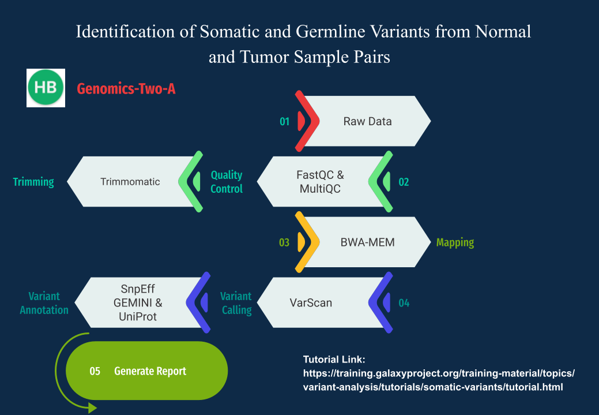

# Identification of somatic and germline variants from tumor and normal sample pairs

## Introduction

This workflow was produced both on the Galaxy platform as well as a Linux Pipeline

# Section one:  `GALAXY WORKFLOW`

<Lets add the galaxy sections here>

 ---
 
# Section Two: `Linux Pipeline`

<Lets add the Linux Section here>
 
 
 

--- 
##  List of team members according to the environment used:

1. Galaxy Workflow:
- @Rachael 
- @Mercy
- @Orinda
- @Heshica
- @Kauthar
- @VioletNwoke
- @AmaraA
- **@Amarachukwu - Gemini annotate(CGI) and Gemini query**
- @Mallika
- @Olamide 
- @Marvellous
- @NadaaHussienn
- @Christabel

2. Linux Workflow
- @Praise 
- @Fredrick
- @RuthMoraa
- @Kauthar
- @Gladys
- @Nanje

